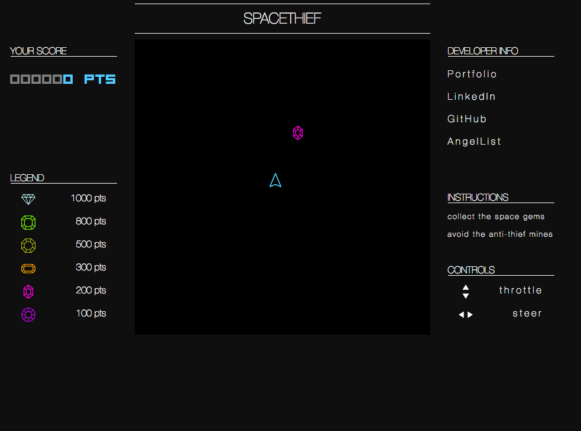

## SpaceThief

### Background
Live: [SpaceThief](https://syriebianco.github.io/SpaceThief/)

[Github](https://github.com/ravisraval/BlingRunner)

SpaceThief is an arcade style game based on collecting tokens and avoiding space mines. The player must collect as many space rocks as possible without detonating the ever-increasing number of mines. The player navigates a ship via thrust and left-right rotational steering to collect space rocks in randomly generated positions and of varying value. Upon collection of each space rock, a moving space mine will generate. Space mines are sensitive to the gravitational fields of the player's spaceship, thus tracking the player.

Functionally, space mines explode upon collision with another mine. An explosion will also occur if the ship collides with a mine, instantly causing the player to lose.

### Functionality  

In this game, players will be able to:

- [ ] Start the game board
- [ ] Play the game by collecting space rocks
- [ ] View their current score
- [ ] Finish the game upon collision with a space mine

### Ship and Mine Physics

A sample of the vector physics.

To simulate motion through space, SpaceThief contains a vector class that accurately handles setting the direction and magnitude of vectors. Closely following equations of motion, the game combines original and resultant vectors of both mines and the ship to create a lifelike simulation of movement through space.

### User Interface and Design

SpaceThief in action!

SpaceThief UI has an appealing, clean layout. The game itself is centered. The left sidebar displays the user's current score and a legend containing gem icons and their corresponding point values. The right sidebar contains links to the developer's personal pages, instructions, and controls.

#### Original Wireframe

### Architecture and Technologies

SpaceThief was made with several key technologies:

- JavaScript and the `jquery` library for overall structure and game logic,
- an adaptation of [Marco Monster's Car Physics](http://www.asawicki.info/Mirror/Car%20Physics%20for%20Games/Car%20Physics%20for%20Games.html) to handle the control of the spaceship
- The Create.js suite for sound, image display, and animation.
- Specifically, the `Easel.js` library, in concert with `HTML5 Canvas,` handles collision detection and resolution.
- Webpack to bundle and serve up the various scripts.

In addition to the webpack entry file, the project involves three scripts:

* `Physics` (`lib/physics.js`)
    * The physics engine for determining the motion of objects.

* `MovingObject` (`lib/moving_object.js`)
    * Base class for anything that moves.
    * Most important methods are `MovingObject.prototype.move`, `MovingObject.prototype.draw(ctx)`,
      `MovingObject.prototype.isCollidedWith(otherMovingObject)`.

* `Moving Object` will have three subclasses:
  * `Ship` (`lib/ship.js`)
      * The logic for the player's motion
  * `SpaceMine` (`lib/space_mine.js`)
      * The logic for the space mines' motion and ship-tracking
  * `SpaceRock` (`lib/space_rock.js`)
      * The logic for the random generation of gems, which inherits from `MovingObject`, even though these pieces will be static.

* `Game` (`lib/game.js`)
    * Holds collections of the ship, gems, and space mines.
    * Tracks the dimensions and bounds of the board.

* `GameView` (`lib/game_view.js`)
    * Holds the instance of the game and Canvas
    * Implements all key-listening and game-play logic

### Implementation Timeline

**Day 1**: Set up the environment by creating the configuration files (`webpack.config.js` and `package.json`), identifying all necessary modules, and installing Easel.js
Setup all necessary Node modules, including getting webpack up and running and `Easel.js` installed.  Learn the basics of Easel.js, and successfully render an element.  

- Have a working environment and skeletal file structure
- Use `Easel.js` to render an object to the `Canvas` element

**Day 2**: Dedicate this day to mastering Easel.js and writing the code for moving pieces.

- Complete the `physics.js` and `ship.js` modules
- Render a ship to a square grid on the `Canvas` using `Easel.js`
- Make the ship navigable by key-downs

**Day 3**: Perfect the physical logic for the spaceship and incorporate space mines and gem collection.  

- Handle the various collisions for both gem collection and space mine detonation
- Be able to track point values

**Day 4**: Polish the UI and adjust physical constants as necessary to enhance gameplay; style the frontend.

- Ensure proper functionality of gameplay
- Have a styled `Canvas`, nice looking controls and title

### Bonus features

To heighten the excitement of SpaceThief, future features may include:

- [ ] Adding a high-score tracking feature that stores user data.
